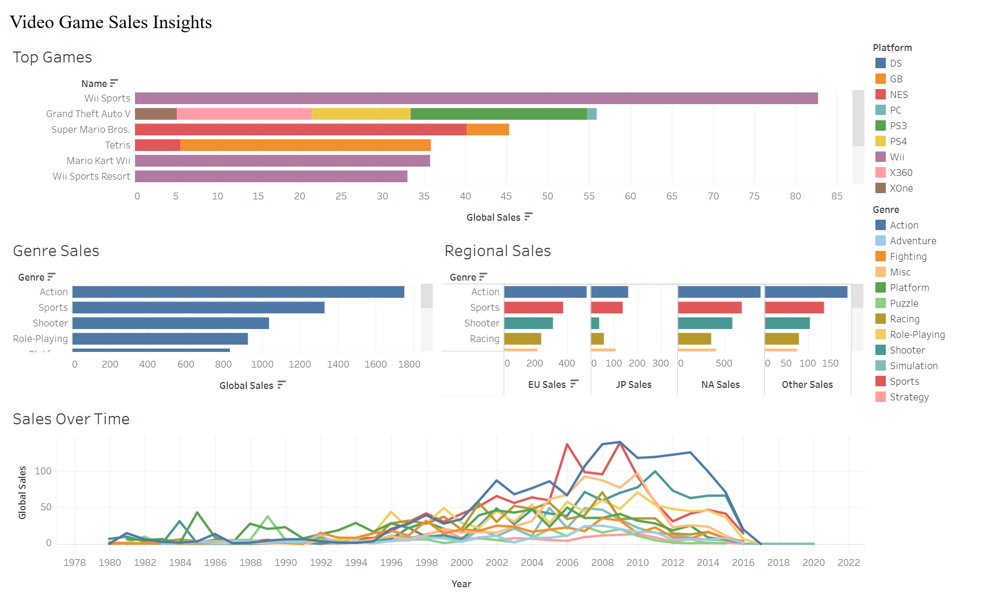

# 🎮 Video Game Sales Dashboard

This project visualizes global video game sales using the `vgsales.csv` dataset. Built in Tableau Public, the dashboard showcases key trends in genre, platform popularity, and regional sales over time.

## 📊 Dashboard Preview

🔗 [View Interactive Tableau Dashboard](https://public.tableau.com/views/VideoGameSalesDashboard_17448243548370/Dashboard2?:language=en-US&:sid=&:redirect=auth&:display_count=n&:origin=viz_share_link)

## 📁 Dataset

- **Source**: Kaggle - [Video Game Sales](https://www.kaggle.com/datasets/gregorut/videogamesales)
- **Rows**: 16,598  
- **Columns**: 11  
- Includes game name, platform, genre, publisher, regional sales, and global sales

## 📈 Key Insights

- Nintendo dominates the top-selling games list
- Sports and Action genres are top performers globally
- Regional preferences vary (e.g., Japan prefers RPGs)

## 💻 Tools Used

- Tableau Public
- Data Cleaning in Excel/Python
- GitHub for version control

## 🗂️ Files

- `vgsales.csv` – The dataset
- `vgsales-dashboard.twbx` – Tableau workbook

